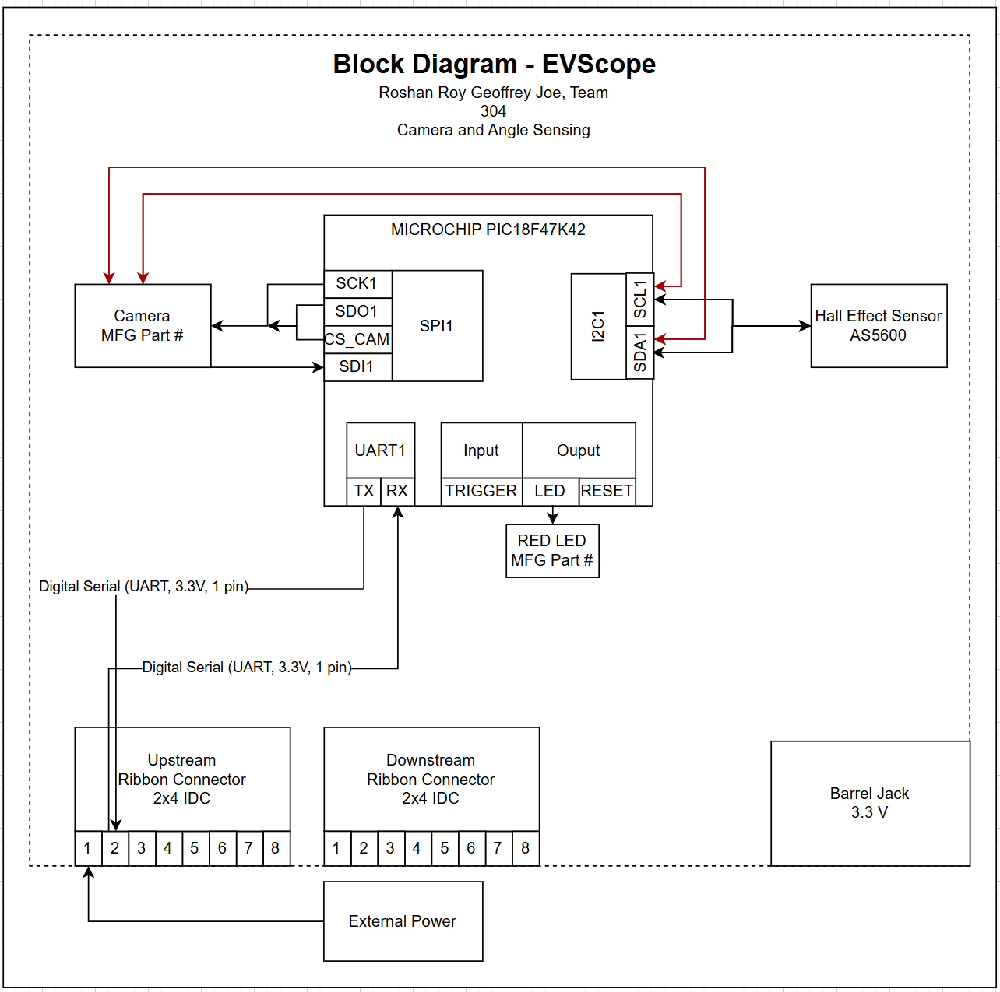

# Individual Block Diagram

### Camera and Angle Sensing Subsystem Block Diagram

This block diagram shows the camera and angle sensing subsystem for the EVScope project developed by Team 304. The subsystem is centered around a Microchip PIC18F47K42 microcontroller, which coordinates image acquisition, angle measurement, and communication with the rest of the system. A camera module interfaces with the microcontroller using an SPI connection for image data transfer, while configuration and auxiliary control signals are handled internally. A Hall effect angle sensor (AS5600) is connected via an I2C interface to provide precise angular position feedback.

The microcontroller communicates with neighboring subsystems through a UART-based daisy-chain using upstream and downstream 2x4 ribbon cable connectors. Simple digital inputs and outputs are used for external trigger control and visual status indication through an onboard LED. Power is supplied either from an external system power source via the ribbon cable or from a local barrel jack, with the subsystem designed to operate at 3.3 V logic levels. This diagram illustrates the logical organization of the subsystem, signal flow direction, and interface boundaries without specifying component values or pin assignments.

