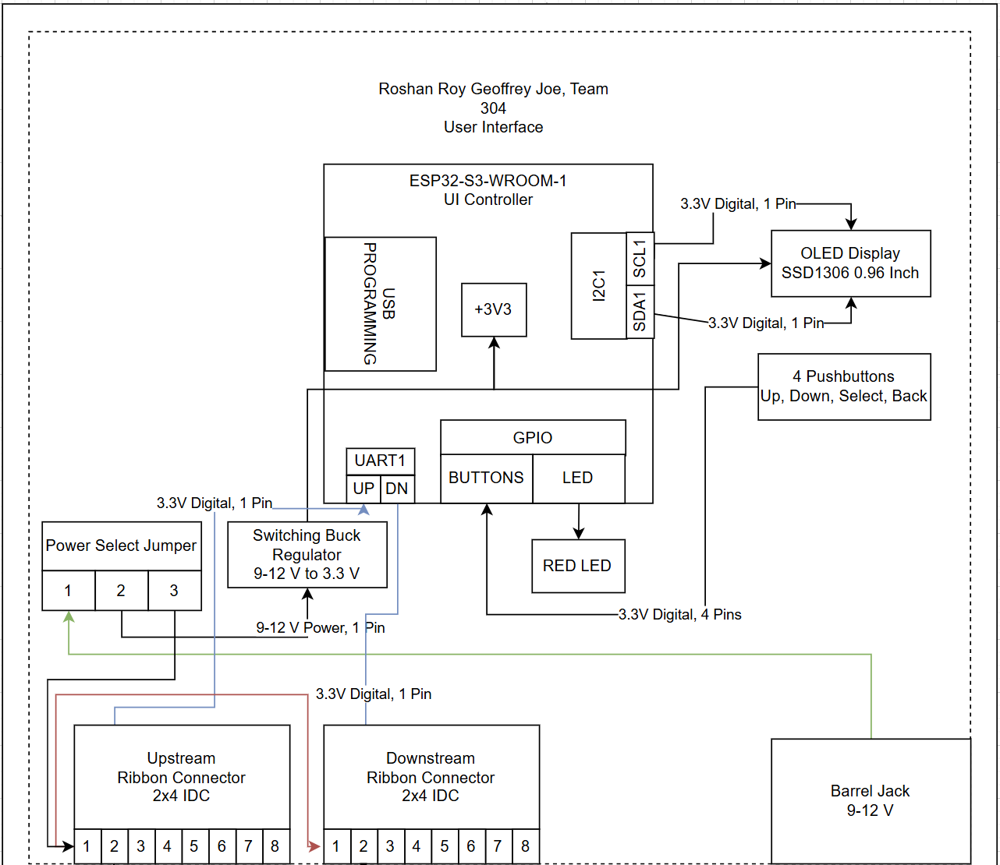

# Individual Block Diagram

## Block Diagram Description

The Human Interface / UI subsystem provides the primary interaction point between the user and the EVScope system. The central component of the subsystem is the ESP32-S3-WROOM microcontroller module, which manages user inputs, display output, and communication with other system components.

Power for the subsystem is supplied through a 9–12 V barrel jack input and regulated down to 3.3 V using a switching buck regulator. This regulated 3.3 V rail powers the ESP32 module, OLED display, and other interface components.

User interaction is handled through several push button inputs connected to ESP32 GPIO pins. These buttons allow the user to navigate menus, trigger system functions, or interact with the device during operation. A status indicator LED connected to a GPIO pin provides a simple visual indication of system state, such as power, activity, or error conditions.

System information and feedback are displayed on a small SSD1306 OLED display connected to the ESP32 using the I2C communication interface. This display allows the subsystem to present system status, configuration information, and user prompts.

Programming and debugging of the ESP32 are supported through a dedicated UART programming header that connects to an external USB-to-UART adapter. This allows firmware to be uploaded and debug messages to be monitored during development and testing.

Additional GPIO pins are routed to expansion headers to support future peripherals or debugging connections. These headers provide access to power, ground, I2C signals, and general-purpose input/output pins for flexible subsystem integration.

