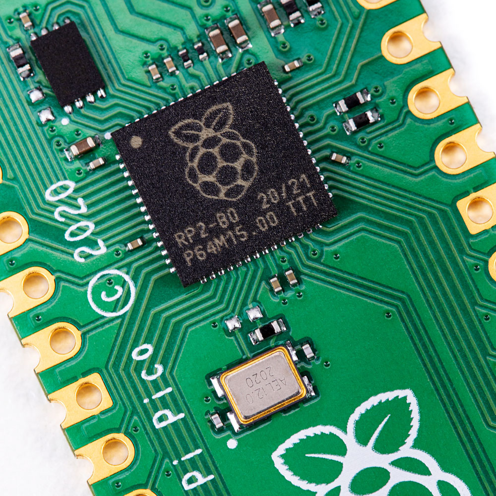
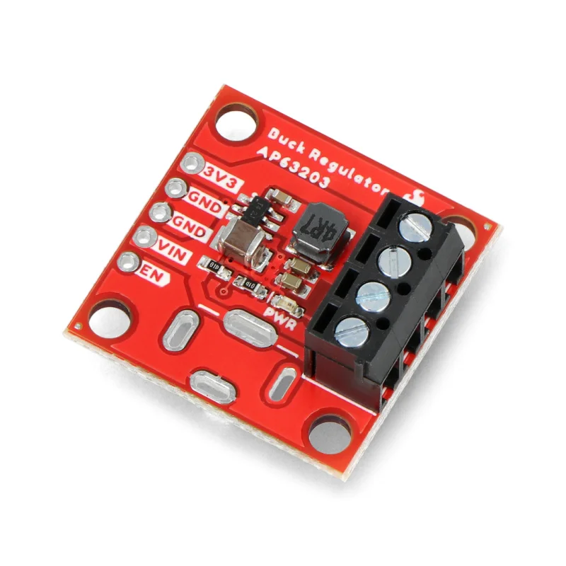
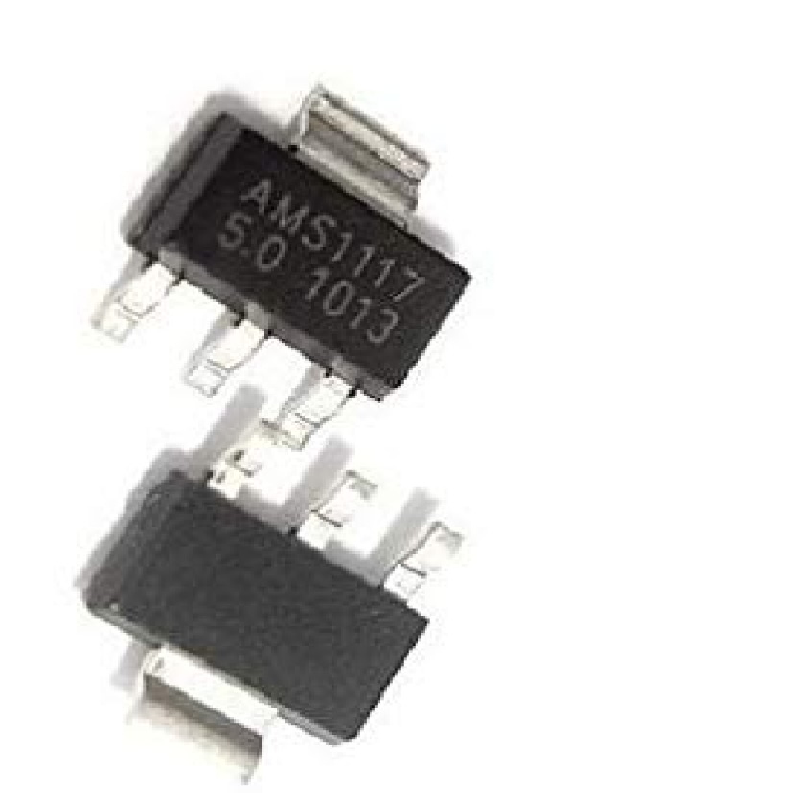
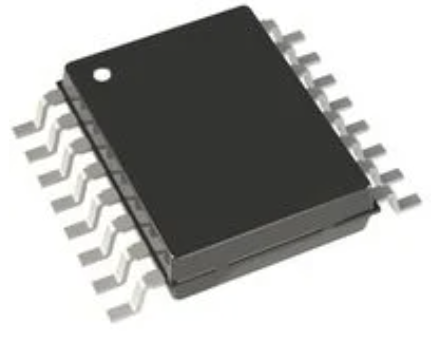
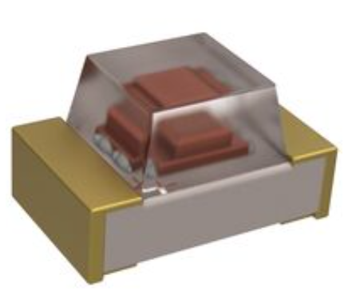
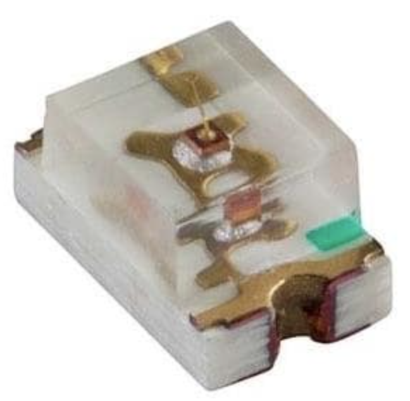

# Component Selection
**Team 304 - Camera and Angle Sensing Subsystem**

This page covers all major components in my subsystem (camera capture, angle sensing, and user indication). All options below are intended to be compatible with a PIC18-class microcontroller design and meet the course preference for surface mount parts, with the note that some camera solutions are sold as small modules that connect through headers/connectors (headers/connectors are allowed exceptions).

---

## Camera Module

| Option | Photo | Vendor link | Unit cost | Pros | Cons |
|---|---|---|---:|---|---|
| **ArduCAM Mini 2MP Plus (OV2640, SPI)** |  | [ArduCAM Mini 2MP Plus OV2640](https://www.arducam.com/arducam-2mp-spi-camera-b0067-arduino.html) | $25.99 | Lower cost, proven SPI camera approach, good resolution for embedded capture | Camera is a module (not a single SMT IC), frame rate depends on SPI speed and processing |
| **ArduCAM Mega 5MP SPI Camera (autofocus)** |  | [ArduCAM Mega 5MP](https://www.arducam.com/presale-mega-5mp-color-rolling-shutter-camera-module-with-autofocus-lens-for-any-microcontroller.html) | $34.99 | Higher resolution, autofocus, designed to be easy to use over SPI with high level commands | Still a module, higher complexity than 2MP option, cost higher than 2MP |
| **ArduCAM 5MP Plus OV5642 (SPI) from SparkFun** |  | [SparkFun OV5642](https://www.sparkfun.com/arducam-5mp-plus-ov5642-mini-camera-module.html) | $72.95 | Strong vendor documentation, reputable distributor option, higher resolution than 2MP | Highest cost, still a module, may be more camera than needed for project requirements |

**Selected:** Option A - ArduCAM Mini 2MP Plus (OV2640, SPI).  
**Rationale:** It best fits the typical embedded constraints for EGR314: lowest cost among reputable, SPI based interface that works well with PIC peripherals, and enough resolution for detection/recording while keeping integration risk manageable compared to higher end camera modules.

---

## Angle Sensor Module

| Option | Photo | Vendor link | Unit cost | Pros | Cons |
|---|---|---|---:|---|---|
| **ams AS5600 (I2C programmable magnetic angle sensor)** |  | [AS5600](https://ams-osram.com/products/sensor-solutions/position-sensors/ams-as5600-position-sensor) | $3.17 | Low cost, common in hobby and embedded, I2C support for configuration, good match to my block diagram | Requires magnet alignment and mechanical fixture, resolution lower than some higher end encoders |
| **ams AS5048A (SPI, 14-bit) or AS5048B (I2C, 14-bit)** |  | [AS5048](https://www.digikey.com/en/product-highlight/a/ams/as5048-magnetic-rotary-encoder) | $7.90 | Higher resolution, strong accuracy and robustness, SPI or I2C variants | Higher cost, still needs magnet and good mechanical alignment |
| **Infineon TLE5012B (magnetic angle sensor)** |  | [TLE5012B](https://www.digikey.com/en/products/detail/infineon-technologies/TLE5012BDE1200XUMA1/5960665) | $5.79 | Reputable industrial sensor option, good performance | Different integration details than AS5600, cost higher than AS5600 |

**Selected:** Option A - AS5600 (I2C).  
**Rationale:** Lowest cost, simplest integration, matches the I2C angle sensing block in my diagram, and meets project needs without over optimizing resolution.

---

## Magnet and Mounting Hardware (Module)

The AS5600 class sensors require a diametrically magnetized magnet and a stable mount to maintain air gap and alignment.

### Candidate solutions (at least 3)

| Option | Photo | Vendor link | Unit cost | Pros | Cons |
|---|---|---|---:|---|---|
| **ams RMH05-DK-XX-1.0 magnet holder (mechanical accessory)** |  | [RMH05](https://www.digikey.com/en/products/detail/ams-osram-usa-inc/RMH05-DK-XX-1-0/3712276) | $6.83 | Purpose built mechanical alignment aid, reduces mounting risk | Adds cost, may not match our exact mechanical geometry |
| **Custom 3D printed mount + diametric magnet** | N/A | N/A | varies | Cheapest and most flexible for our mechanical layout | Requires careful iteration, print tolerance and magnet sourcing |
| **Higher integration angle sensor package with more robust mechanical tolerance plus simple magnet mount** | N/A | [AS5048](https://www.digikey.com/en/product-highlight/a/ams/as5048-magnetic-rotary-encoder) | Sensor cost plus magnet | Better tolerance and accuracy, still simple conceptually | Higher total cost, still needs a magnet solution |

**Selected: Option B - Custom 3D printed mount + magnet.**  
**Rationale:** Most compatible with student project mechanical constraints, flexible for mounting near the subsystem shaft, and avoids buying a holder that may not match our form factor.

---

## Status Indicator LED Module

| Option | Photo | Vendor link | Unit cost | Pros | Cons |
|---|---|---|---:|---|---|
| **Kingbright AP2012EC (0805 red LED)** |  | [DigiKey AP2012EC red 0805 LED](https://www.digikey.com/en/products/detail/kingbright/AP2012EC/2658844) | varies by qty | Meets SMT requirement, simple GPIO drive, easy placement | Requires current limiting (handled in schematic stage) |
| **Single Color LED Ultra Red 660 nm Water Clear** |  | [Single Color LEDs Ultra Red 660 nm Water Clear](https://www.mouser.com/ProductDetail/Bivar/SM0805URC?qs=hWDdE2Pc5RBc6Sbhf77jsQ%3D%3D&srsltid=AfmBOopeXy8JRdC2HAgqY_1hTAScqM53Gh0NaHuSJ8B_5eJW4_7dcizT) | $0.30 | Many choices for brightness and lens type, easy to source | Must pick final part number later |
| **LED BLUE/RED CLEAR 2012 SMD** |  | [LED BLUE/RED CLEAR 2012 SMD](https://www.digikey.com/en/products/detail/kingbright/APHBM2012QBDSURKC/2263566) | varies | Allows multiple states without extra LEDs | More pins and firmware complexity |

**Selected:** Option A - Kingbright AP2012EC (0805 red LED).

**Rationale:** Simple, common, SMT compliant, and matches the block diagram need for a basic status indicator.

