# Component Selection
**Team 304 - Camera and Angle Sensing Subsystem**

This page covers all major components in my subsystem including the embedded controller, power regulation, user interface display, and status indication. All options below follow the course preference for surface mount components where possible. Some interface devices (camera modules and displays) are provided as small modules that connect through headers, which are allowed exceptions.

---

## Embedded Controller (ESP32 Module)

| Option | Photo | Vendor link | Unit cost | Pros | Cons |
|---|---|---|---:|---|---|
| **ESP32-S3-WROOM-1 Module** | 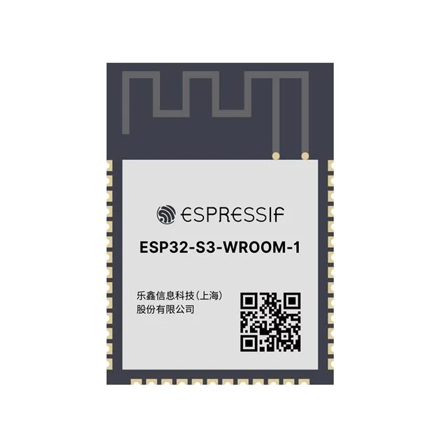 | https://www.espressif.com/en/products/modules/esp32-s3-wroom-1 | ~$6.00 | Surface mount module, integrated WiFi and Bluetooth, large GPIO count, widely supported | Requires external programming interface |
| **ESP32-WROOM-32 Module** | 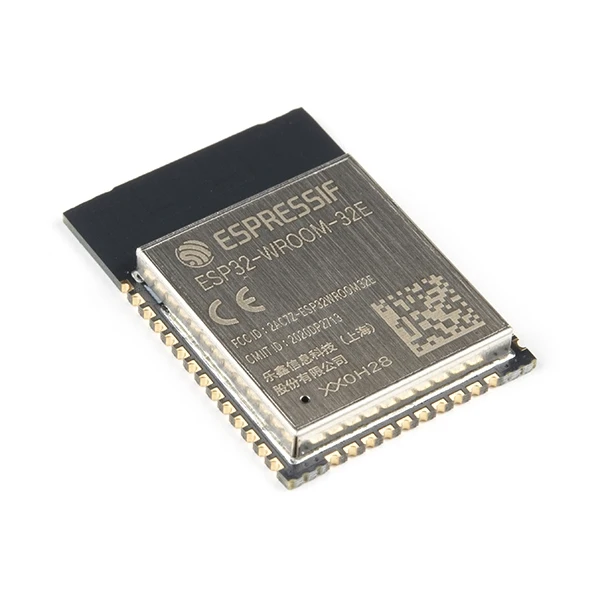 | https://www.espressif.com/en/products/modules/esp32-wroom-32 | ~$5.00 | Mature ecosystem, well documented, simple integration | Older architecture, fewer AI features than S3 |
| **RP2040 Microcontroller** | 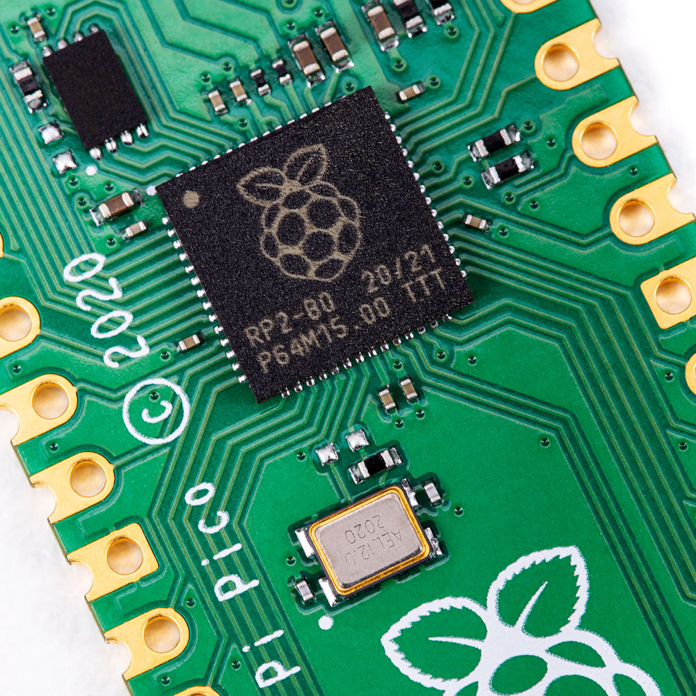 | https://www.raspberrypi.com/products/rp2040/ | ~$1.00 | Very low cost, strong community support | No built-in wireless connectivity |

**Selected:** Option A – ESP32-S3-WROOM-1.

**Rationale:**  
The ESP32-S3-WROOM module provides integrated wireless capability, sufficient GPIO for subsystem integration, and is available as a surface mount module compatible with PCB assembly requirements. It also includes onboard flash, RF matching, and crystal oscillator which simplifies the hardware design.

---

## Power Regulation (Switching Regulator)

| Option | Photo | Vendor link | Unit cost | Pros | Cons |
|---|---|---|---:|---|---|
| **Diodes Inc. AP63203WU Buck Converter** | 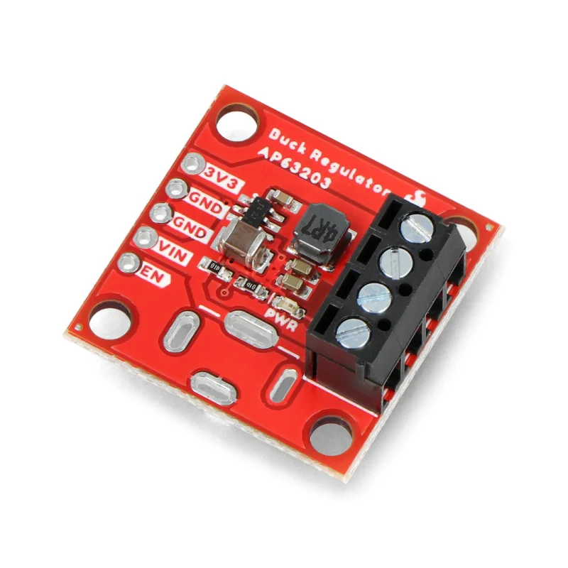 | https://www.diodes.com/part/view/AP63203WU | ~$0.90 | High efficiency switching regulator, compact SOT563 package, supports up to 32V input | Slightly more complex layout than linear regulators |
| **LM1117 Linear Regulator (3.3V)** | 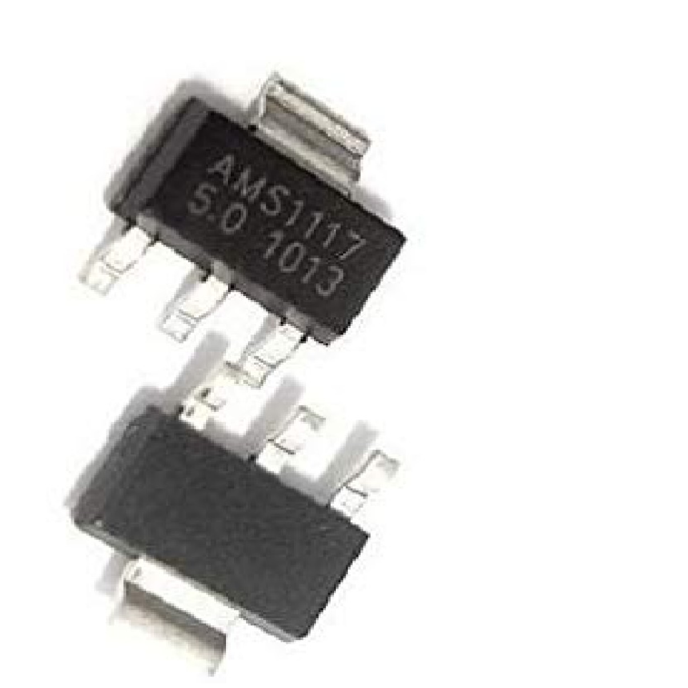 | https://www.ti.com/product/LM1117 | ~$0.60 | Very simple design and minimal components | Low efficiency with large input voltage difference |
| **MP1584 Buck Regulator** | 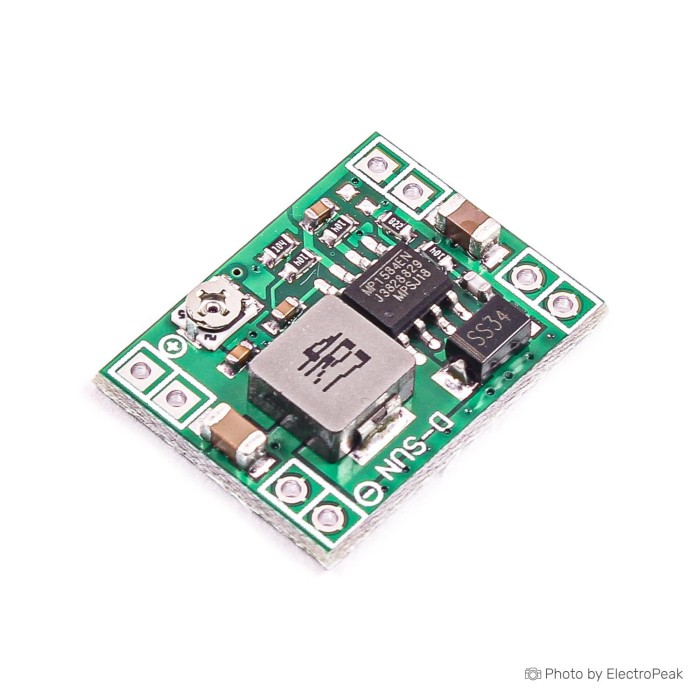 | https://www.monolithicpower.com/en/mp1584.html | ~$1.50 | High current capability and efficient switching | Larger package footprint |

**Selected:** Option A – AP63203WU Switching Regulator.

**Rationale:**  
The subsystem receives 9–12V from the barrel jack input. The AP63203 efficiently steps this voltage down to 3.3V required by the ESP32 module while minimizing heat dissipation compared to linear regulators. Its compact surface mount package also fits well within PCB space constraints.

---

## OLED Display Module (User Interface)

| Option | Photo | Vendor link | Unit cost | Pros | Cons |
|---|---|---|---:|---|---|
| **SSD1306 0.96" I2C OLED Display** | 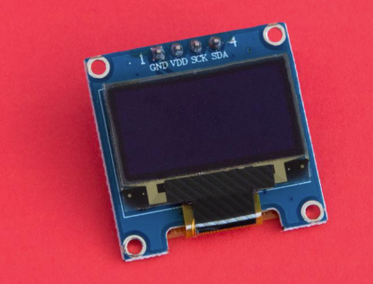 | https://www.adafruit.com/product/326 | ~$5.00 | Simple I2C interface, low power, widely used library support | Monochrome display |
| **1.3" SH1106 OLED Display** | 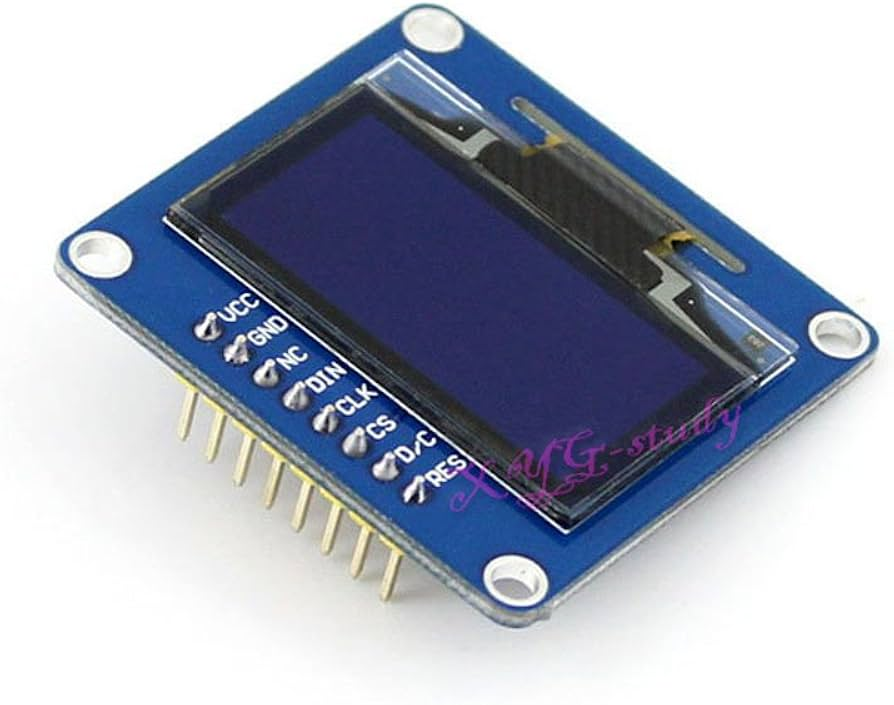 | https://www.waveshare.com/1.3inch-oled-module.htm | ~$7.00 | Slightly larger display area | Different driver and library requirements |
| **ST7735 SPI TFT Display** | 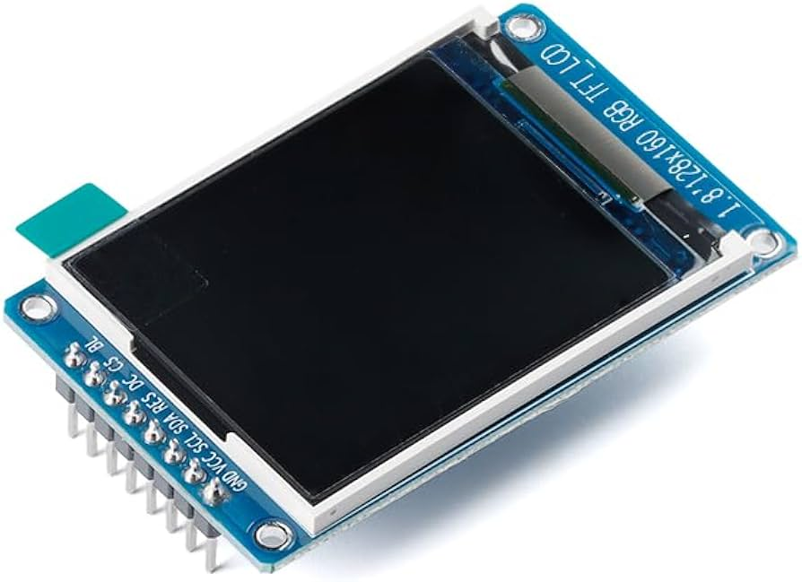 | https://www.adafruit.com/product/358 | ~$10.00 | Full color graphics capability | Higher power consumption and more pins required |

**Selected:** Option A – SSD1306 0.96" I2C OLED Display.

**Rationale:**  
The SSD1306 OLED display provides a compact and easy-to-integrate interface using the I2C bus already available on the ESP32. It allows simple status messages and system feedback without requiring many microcontroller pins.

---

## Programming Interface (USB to UART)

| Option | Photo | Vendor link | Unit cost | Pros | Cons |
|---|---|---|---:|---|---|
| **CP2102 USB-to-UART Adapter** | 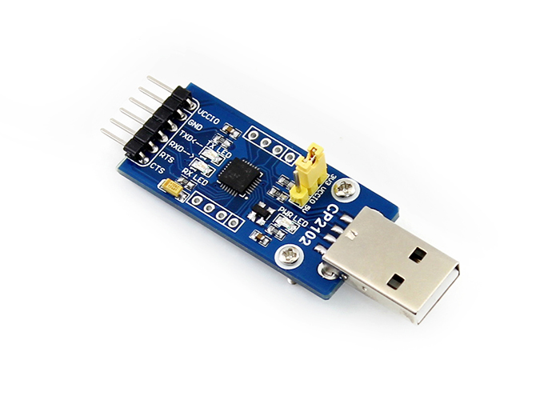 | https://www.silabs.com/interface/usb-bridges/classic/device.cp2102 | ~$3.00 | Reliable USB serial interface commonly used with ESP32 | Requires external module |
| **FT232RL USB-to-UART Adapter** | 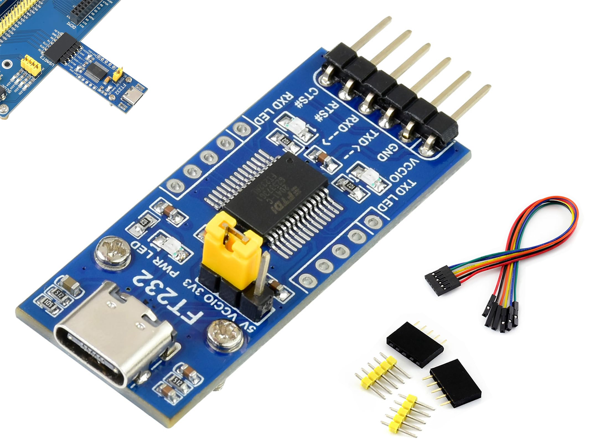 | https://ftdichip.com/products/ft232rl/ | ~$4.00 | Very reliable and well supported drivers | Higher cost |
| **CH340 USB-to-UART Adapter** | 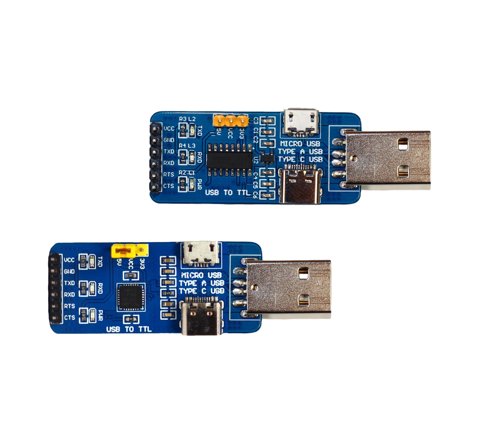 | https://www.wch-ic.com/products/CH340.html | ~$2.00 | Lowest cost option | Driver installation sometimes required |

**Selected:** Option C – CH340 USB-to-UART Adapter.

**Rationale:**  
The CH340 USB-to-UART interface allows programming of the ESP32 through a simple 6-pin programming header while keeping the PCB design simple. Using an external adapter reduces PCB complexity and is common in embedded development boards.

---

## Status Indicator LED Module

| Option | Photo | Vendor link | Unit cost | Pros | Cons |
|---|---|---|---:|---|---|
| **Kingbright AP2012EC (0805 red LED)** | 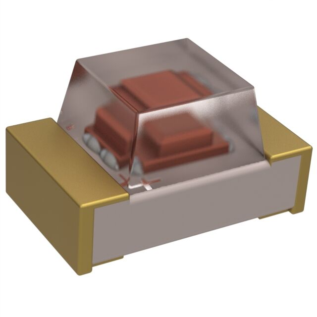 | https://www.digikey.com/en/products/detail/kingbright/AP2012EC/2658844 | ~$0.10 | Small SMT package, simple GPIO control, low cost | Single color only |
| **Bi-color LED (Red/Green)** | 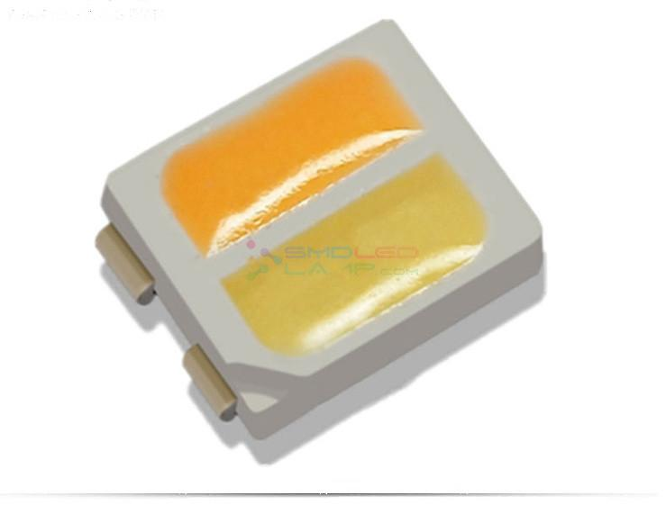 | https://www.digikey.com/en/products/detail/kingbright/APHBM2012QBDSURKC | ~$0.25 | Can indicate multiple states | Requires additional GPIO control |
| **RGB LED (SMD)** | 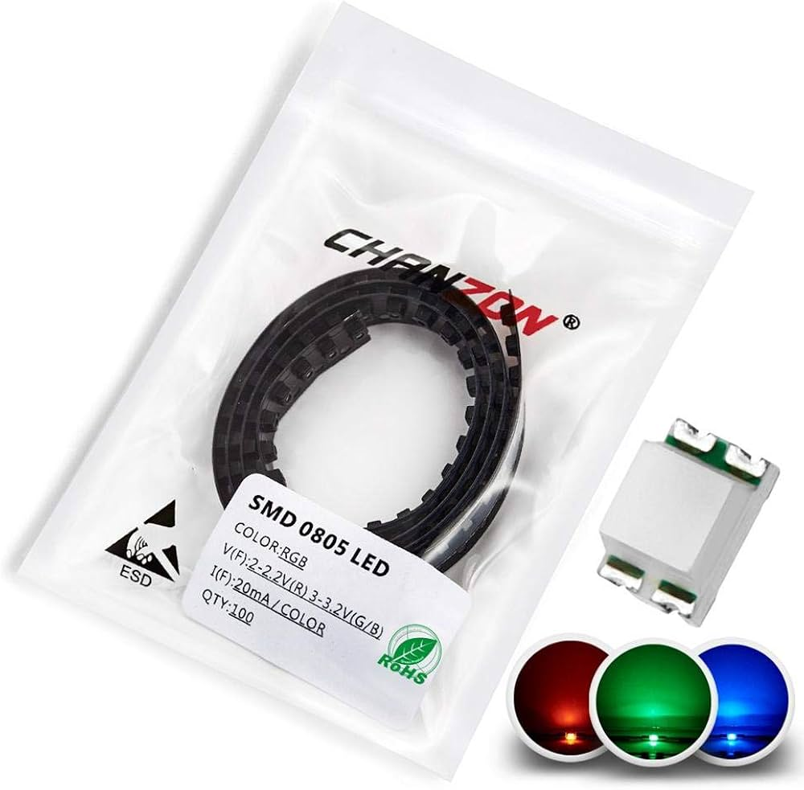 | https://www.digikey.com/en/products/detail/kingbright/APTF2012LSEEZGKQBKC | ~$0.50 | Full color indication | Requires multiple control pins |

**Selected:** Option A – Kingbright AP2012EC (0805 red LED).

**Rationale:**  
A simple single-color LED provides sufficient visual feedback for system status such as power, initialization, or error indication while minimizing circuit complexity.