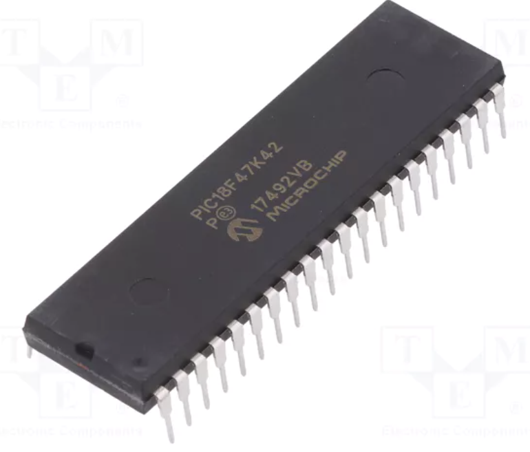
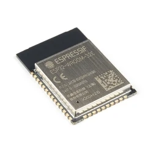
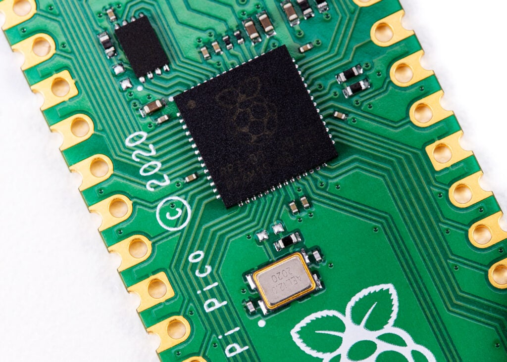
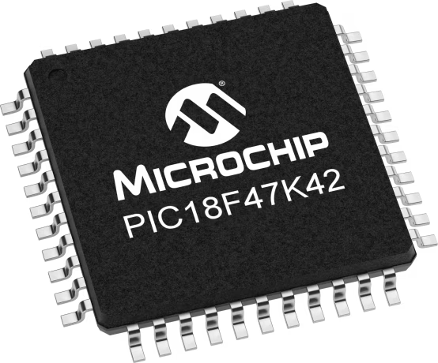
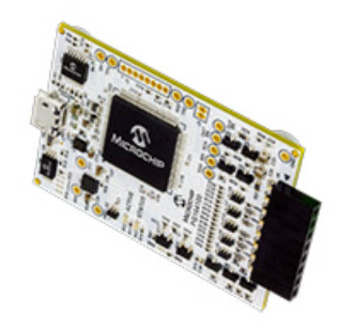

# Microcontroller Selection - EVScope
**Team 304 - Camera and Angle Sensing Subsystem**

This page justifies the microcontroller choice for my subsystem. My subsystem needs:
- SPI peripheral for camera data/control
- I2C peripheral for magnetic angle sensor (AS5600)
- UART for team communications or debug (as required by integration)
- Several GPIO pins for trigger input, status LED, reset control, and connector signals
- In circuit programming and debugging support using a Snap programmer

---

| Option | Photo | Vendor link | Unit cost | Pros | Cons |
|---|---|---|---:|---|---|
| **Microchip PIC18F47K42-I/PT (44-TQFP, SMT)** |  | [PIC18F47K42-I-PT](https://www.digikey.com/en/products/detail/microchip-technology/PIC18F47K42-I-PT/7561733) | $2.79 | Matches course ecosystem, supports SPI, I2C, UART, SMT package, solid documentation, works with MPLAB tools | 8-bit limitations for heavy image processing, must manage bandwidth and buffering carefully |
| **Microchip PIC18F46K42-I/PT (44-TQFP, SMT)** |  | [PIC18F46K42-I-PT](https://www.digikey.com/en/products/detail/microchip-technology/PIC18F46K42-I-PT/7559457) | $2.54 | Very similar peripheral set, potentially simpler if memory needs are lower | Less program memory than PIC18F47K42, fewer safety margins for camera libraries and features |
| **ST STM32G031K8T6 (32-bit, SMT)** |  | [STM32G031K8T6](https://www.digikey.com/en/products/detail/stmicroelectronics/STM32G031K8T6/10300267) | $2.32 | 32-bit performance, strong peripheral support, good for higher throughput | Toolchain and course workflow may be less aligned, higher integration risk for this class |
| **Microchip ATmega4809-AU (AVR, SMT)** |  | [ATmega4809-AU](https://www.digikey.com/en/products/detail/microchip-technology/ATMEGA4809-AU/10444928) | $1.74 | Common, low cost, plenty of example code | Integration and course support may not match PIC workflow, performance constraints similar to PIC but with different ecosystem |

**Selected:** Microchip PIC18F47K42-I/PT (44-TQFP, SMT).

**Rationale:** This device is the best fit for my subsystem because it natively supports the exact interfaces needed (SPI for camera, I2C for AS5600, UART for integration) while staying fully aligned with the class Microchip toolchain and programming flow. The selected package is surface mount, matching the project requirement.

---

## In circuit programming and debugging
**Programmer/debugger:** MPLAB Snap (PG164100).  
- Product references: [MPLAB Snap PG164100](https://www.digikey.com/en/products/detail/microchip-technology/PG164100/9562532)
  

**How it connects in the design:**
- Add an ICSP style programming header on the PCB and route the required programming pins from the PIC to that header.
- Ensure power and ground are available during programming, and the reset line is handled correctly for programming entry.

---

## Microcontroller peripherals used in my subsystem
- **SPI1:** Camera module interface (SCK, SDO, SDI, CS)
- **I2C1:** AS5600 angle sensor interface (SCL, SDA)
- **UART1:** Team integration or debug interface (TX, RX)
- **GPIO:** Trigger input, LED output, reset control line (as shown in my diagram)