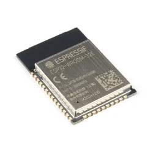
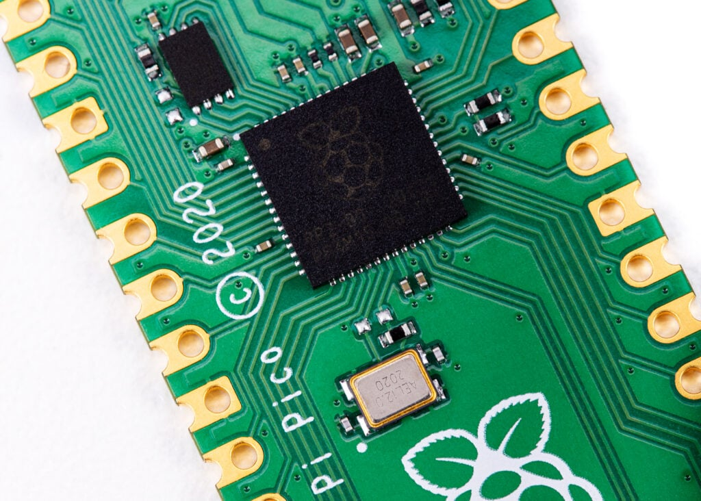
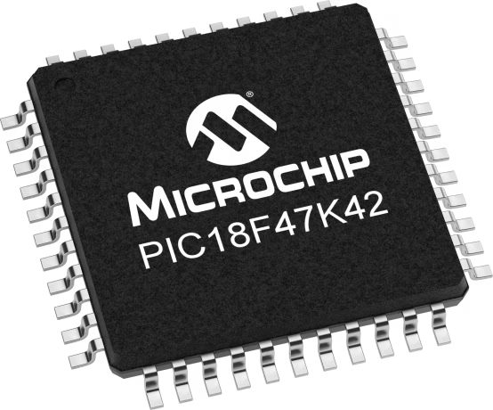
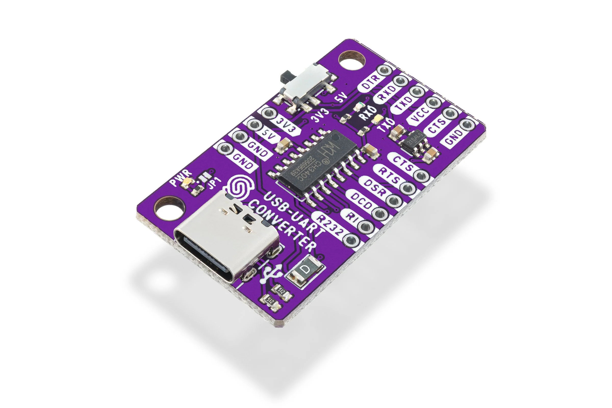

# Microcontroller Selection - EVScope
**Team 304 - Human Interface / UI Subsystem**

This page justifies the microcontroller choice for the Human Interface / UI subsystem. This subsystem is responsible for managing the display interface, handling user inputs, and communicating status information between the user and the rest of the EVScope system.

The microcontroller must support the following interfaces and capabilities:

- I2C peripheral for the OLED display interface (SSD1306)
- UART for programming and debug communication
- Several GPIO pins for user input buttons, status LED, and expansion headers
- External programming interface through a UART programming header
- Reliable surface mount package suitable for PCB assembly
- Sufficient processing capability to manage display updates and user input events

---

## Microcontroller Options

| Option | Photo | Vendor link | Unit cost | Pros | Cons |
|---|---|---|---:|---|---|
| **Espressif ESP32-S3-WROOM-1 (SMT module)** |  | https://www.espressif.com/en/products/modules/esp32-s3-wroom-1 | ~$6.00 | Integrated WiFi and Bluetooth, large number of GPIOs, powerful dual-core processor, integrated flash and RF circuitry simplifies hardware design | Slightly higher cost than simple MCUs, requires external programming interface |
| **Espressif ESP32-WROOM-32 (SMT module)** |  | https://www.espressif.com/en/products/modules/esp32-wroom-32 | ~$5.00 | Mature ecosystem, strong community support, similar wireless capabilities | Older architecture, fewer AI and acceleration features than ESP32-S3 |
| **Raspberry Pi RP2040 Microcontroller** |  | https://www.raspberrypi.com/products/rp2040/ | ~$1.00 | Very low cost, good performance for embedded control tasks | No integrated wireless connectivity, additional circuitry required |
| **Microchip PIC18F47K42-I/PT (44-TQFP)** |  | https://www.digikey.com/en/products/detail/microchip-technology/PIC18F47K42-I-PT/7561733 | $2.79 | Compatible with Microchip toolchain used in class, reliable peripheral set | Limited performance compared to modern 32-bit microcontrollers |

**Selected:** Espressif ESP32-S3-WROOM-1 (surface mount module).

**Rationale:**  
The ESP32-S3-WROOM-1 module provides a powerful and flexible embedded controller for the Human Interface subsystem. The module includes integrated flash memory, RF circuitry, and a crystal oscillator, reducing the number of required external components. It provides more than enough GPIO and communication peripherals for the subsystem while remaining available as a surface mount module suitable for PCB assembly.

The additional processing capability also provides flexibility for future features such as more advanced UI behavior, data processing, or wireless connectivity.

---

## Programming and Debug Interface

The ESP32-S3 module is programmed through a **UART programming interface** connected to a standard programming header on the PCB.

**Programming method:** External USB-to-UART adapter.

Typical adapters include:

- CH340 USB-to-UART
- CP2102 USB-to-UART
- FT232 USB-to-UART

**Programming header signals:**

- 3V3
- GND
- TXD0
- RXD0
- EN (reset)
- BOOT (GPIO0)

These signals allow the ESP32 to enter firmware download mode and receive firmware through the UART interface.

---

## Microcontroller peripherals used in my subsystem

The ESP32-S3 uses the following peripherals for the Human Interface subsystem:

**I2C Interface**
- Used to communicate with the SSD1306 OLED display
- Signals: SDA, SCL

**UART Interface**
- Used for programming and debugging
- Signals: TXD0, RXD0

**GPIO**
Used for system interaction and user feedback:

- Push button inputs
- Status LED output
- Reset (EN) control
- Boot mode selection (GPIO0)
- Expansion header GPIO lines for future peripherals

---

## Expansion and Integration

The subsystem includes expansion headers connected to several ESP32 GPIO pins. These allow additional peripherals or sensors to be added without redesigning the PCB.

Expansion header signals include:

- 3V3
- GND
- I2C (SDA, SCL)
- Several general purpose GPIO pins