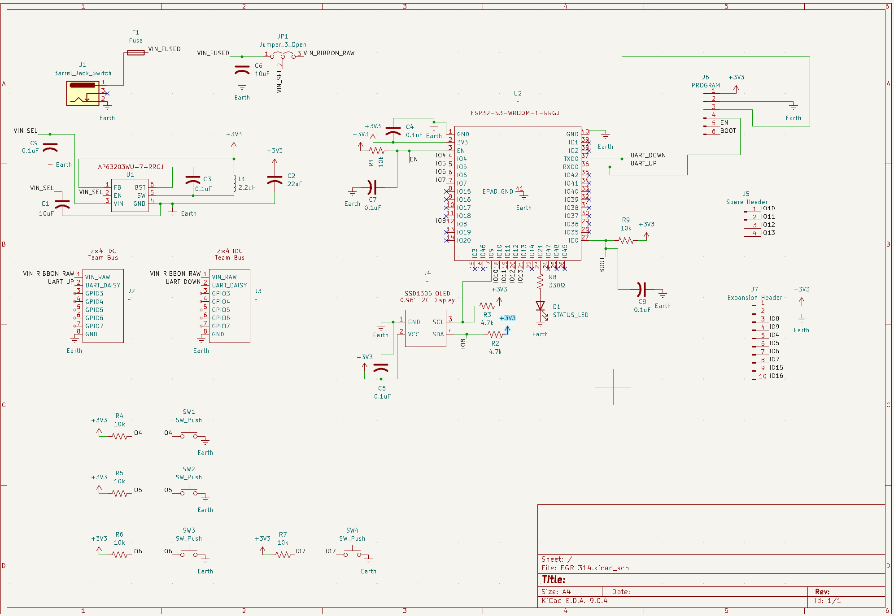

## Overview
Below is the overall schematic for the Human Interface/UI Subsystem:

This is the PDF file of the schematic: [Schematic](Schematic.pdf)

### Schematic Specifications

Resistors

* 10 kΩ pull-ups for EN, BOOT, and buttons

* 4.7 kΩ pull-ups for I2C SDA/SCL

* 330 Ω current-limiting resistor for status LED

* Tolerance: 1%

* Power rating: 1/8 W

Capacitors

* 10 µF input cap, ceramic, 16 V minimum

* 22 µF output cap, ceramic, 6.3 V minimum

* 0.1 µF bootstrap cap, ceramic, 16 V minimum

* 0.1 µF decoupling caps, ceramic, 6.3 V minimum

Fuse

* 0.5 A to 1 A input protection fuse

* Polyfuse preferred for convenience

Inductor

* 2.2 µH

* Less than 1 A saturation current
